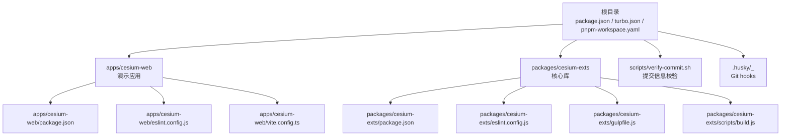
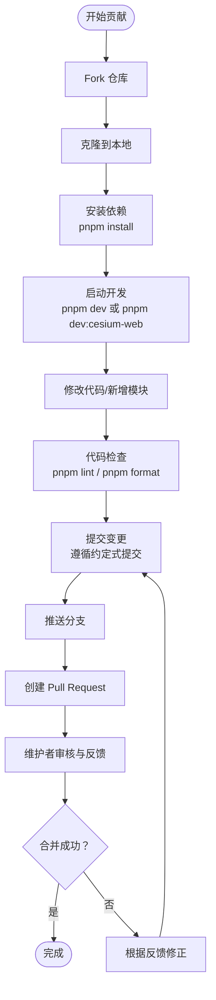
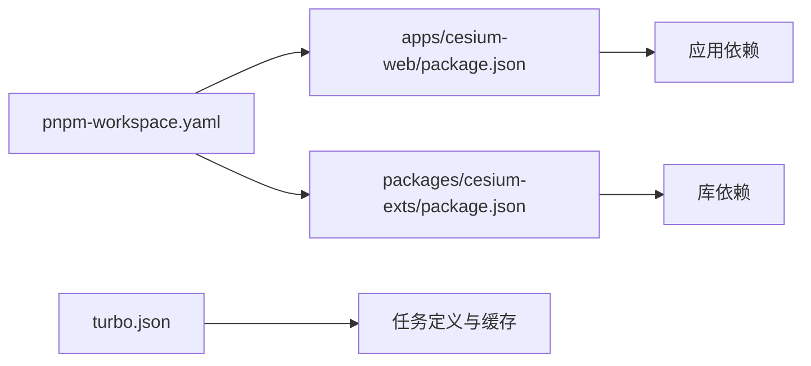

# 贡献指南

<cite>
**本文引用的文件**
- [README.md](file://README.md)
- [package.json](file://package.json)
- [turbo.json](file://turbo.json)
- [pnpm-workspace.yaml](file://pnpm-workspace.yaml)
- [scripts/verify-commit.sh](file://scripts/verify-commit.sh)
- [apps/cesium-web/package.json](file://apps/cesium-web/package.json)
- [apps/cesium-web/eslint.config.js](file://apps/cesium-web/eslint.config.js)
- [apps/cesium-web/vite.config.ts](file://apps/cesium-web/vite.config.ts)
- [.husky/_](file://.husky/_)
- [packages/cesium-exts/package.json](file://packages/cesium-exts/package.json)
- [packages/cesium-exts/eslint.config.js](file://packages/cesium-exts/eslint.config.js)
- [packages/cesium-exts/gulpfile.js](file://packages/cesium-exts/gulpfile.js)
- [packages/cesium-exts/scripts/build.js](file://packages/cesium-exts/scripts/build.js)
</cite>

## 目录

1. [简介](#简介)
2. [项目结构](#项目结构)
3. [核心组件](#核心组件)
4. [架构总览](#架构总览)
5. [详细组件分析](#详细组件分析)
6. [依赖分析](#依赖分析)
7. [性能考虑](#性能考虑)
8. [故障排查指南](#故障排查指南)
9. [结论](#结论)
10. [附录](#附录)

## 简介

本指南面向开源贡献者，提供从 Fork、Clone、开发、测试到提交 Pull Request 的完整流程与规范。项目采用 Monorepo 架构，使用 Turborepo + pnpm workspace 管理多包；前端演示应用基于 Vite + React；核心库使用 Gulp + Rollup 构建。代码质量由 ESLint + Prettier 保障，Git 提交通过 Husky 钩子与脚本进行规范化校验。

## 项目结构

- 根目录包含 monorepo 根配置与顶层脚本，统一管理各包的开发、构建、检查与格式化。
- apps/cesium-web 为演示应用，提供交互式开发体验与示例页面。
- packages/cesium-exts 为核心扩展库，包含功能模块与工具函数，提供多种构建产物格式。
- scripts/verify-commit.sh 用于校验提交信息格式。
- .husky/\_ 存放 Git hooks，配合根脚本 prepare 安装钩子。

图表来源

- [package.json:1-35](file://package.json#L1-L35)
- [turbo.json:1-16](file://turbo.json#L1-L16)
- [pnpm-workspace.yaml:1-12](file://pnpm-workspace.yaml#L1-L12)
- [apps/cesium-web/package.json:1-51](file://apps/cesium-web/package.json#L1-L51)
- [apps/cesium-web/eslint.config.js:1-37](file://apps/cesium-web/eslint.config.js#L1-L37)
- [apps/cesium-web/vite.config.ts:1-81](file://apps/cesium-web/vite.config.ts#L1-L81)
- [packages/cesium-exts/package.json:1-48](file://packages/cesium-exts/package.json#L1-L48)
- [packages/cesium-exts/eslint.config.js:1-38](file://packages/cesium-exts/eslint.config.js#L1-L38)
- [packages/cesium-exts/gulpfile.js:1-16](file://packages/cesium-exts/gulpfile.js#L1-L16)
- [packages/cesium-exts/scripts/build.js:1-187](file://packages/cesium-exts/scripts/build.js#L1-L187)

章节来源

- [README.md:90-123](file://README.md#L90-L123)
- [package.json:1-35](file://package.json#L1-L35)
- [turbo.json:1-16](file://turbo.json#L1-L16)
- [pnpm-workspace.yaml:1-12](file://pnpm-workspace.yaml#L1-L12)

## 核心组件

- 根级脚本与工作流
  - 顶层 package.json 提供统一命令：开发、构建、代码检查、格式化、安装 hooks。
  - turbo.json 定义缓存、输入输出与任务依赖关系，确保多包构建顺序与增量构建。
  - pnpm-workspace.yaml 声明工作空间与 catalog 版本约束，统一依赖版本。
- 应用层（apps/cesium-web）
  - Vite 配置提供开发服务器、别名、构建优化与产物命名策略。
  - ESLint 配置覆盖 TS/TSX 文件，规则包含对未使用变量与显式 any 的告警控制。
- 库层（packages/cesium-exts）
  - Gulp + Rollup 构建链路：自动生成统一入口文件，再进行多格式打包与类型声明生成。
  - ESLint 配置排除构建输出、类型声明与脚本目录，聚焦源码质量。
- 提交与质量门禁
  - verify-commit.sh 校验提交信息格式，遵循约定式提交规范。
  - .husky/\_ 与根 prepare 脚本集成，确保本地钩子可用。

章节来源

- [package.json:5-27](file://package.json#L5-L27)
- [turbo.json:3-13](file://turbo.json#L3-L13)
- [pnpm-workspace.yaml:4-12](file://pnpm-workspace.yaml#L4-L12)
- [apps/cesium-web/vite.config.ts:9-81](file://apps/cesium-web/vite.config.ts#L9-L81)
- [apps/cesium-web/eslint.config.js:8-36](file://apps/cesium-web/eslint.config.js#L8-L36)
- [packages/cesium-exts/gulpfile.js:7-15](file://packages/cesium-exts/gulpfile.js#L7-L15)
- [packages/cesium-exts/scripts/build.js:27-63](file://packages/cesium-exts/scripts/build.js#L27-L63)
- [packages/cesium-exts/eslint.config.js:16-37](file://packages/cesium-exts/eslint.config.js#L16-L37)
- [scripts/verify-commit.sh:7-29](file://scripts/verify-commit.sh#L7-L29)

## 架构总览

下图展示贡献流程的关键节点：Fork/Clone → 本地安装 → 开发调试 → 质量检查 → 提交与 PR。

图表来源

- [package.json:5-11](file://package.json#L5-L11)
- [scripts/verify-commit.sh:7-29](file://scripts/verify-commit.sh#L7-L29)

## 详细组件分析

### 开发工作流程与分支策略

- 分支建议
  - 主分支保持稳定，功能开发在特性分支进行，修复在 hotfix 分支进行。
  - 分支命名建议采用小写与短横线组合，如 feature/add-module、fix/bug-name。
- 提交信息规范
  - 使用约定式提交，格式为 type(scope?): message。
  - 支持类型包括 feat、fix、docs、style、refactor、perf、test、build、ci、chore、revert、remove、config 等。
  - 提交信息校验由 verify-commit.sh 执行，不符合格式将阻断提交。
- 提交前检查清单
  - 本地运行 pnpm lint 与 pnpm format，确保无 ESLint 错误且格式统一。
  - 本地运行 pnpm test（若存在测试脚本），确保功能正常。
  - 验证构建产物（如适用）与示例页面可正常加载。

章节来源

- [scripts/verify-commit.sh:7-29](file://scripts/verify-commit.sh#L7-L29)
- [package.json:13-20](file://package.json#L13-L20)

### 代码贡献步骤（Fork → Clone → 开发 → 测试 → PR）

- Fork 与 Clone
  - 在 GitHub 上 Fork 仓库，然后克隆到本地。
- 安装与启动
  - 在根目录执行 pnpm install 安装依赖。
  - 使用 pnpm dev 启动全部包的开发服务，或使用 pnpm dev:cesium-web 启动演示应用。
- 新增模块与开发
  - 在 apps/cesium-web 中进行演示与交互开发。
  - 在 packages/cesium-exts 中实现核心功能模块，遵循现有目录与导出规范。
- 质量与测试
  - 使用 pnpm lint 检查代码风格，使用 pnpm format 格式化代码。
  - 如需构建库产物，可在 packages/cesium-exts 目录执行构建脚本。
- 提交与 PR
  - 提交信息遵循约定式提交规范。
  - 推送分支后创建 PR，等待维护者审核与反馈。

章节来源

- [README.md:31-64](file://README.md#L31-L64)
- [package.json:5-11](file://package.json#L5-L11)
- [apps/cesium-web/package.json:6-11](file://apps/cesium-web/package.json#L6-L11)
- [packages/cesium-exts/package.json:16-19](file://packages/cesium-exts/package.json#L16-L19)

### 代码风格规范、ESLint 规则与 Prettier 要求

- ESLint 配置
  - 应用层（apps/cesium-web）：启用推荐规则集，针对 TS/TSX 文件配置语言选项与插件，对未使用变量与显式 any 进行告警控制。
  - 库层（packages/cesium-exts）：排除构建输出、类型声明与脚本目录，聚焦源码质量，规则包含对未使用变量与显式 any 的告警。
- Prettier
  - 顶层 package.json 集成 lint-staged 与 Prettier，对 JS/TS/JSON/TSX/CSS/SCSS/HTML/Markdown 等文件进行格式化。
  - 提供统一的格式化命令 pnpm format，确保团队风格一致。

章节来源

- [apps/cesium-web/eslint.config.js:8-36](file://apps/cesium-web/eslint.config.js#L8-L36)
- [packages/cesium-exts/eslint.config.js:16-37](file://packages/cesium-exts/eslint.config.js#L16-L37)
- [package.json:13-20](file://package.json#L13-L20)

### Git 提交消息格式与 Husky 钩子

- 提交消息格式
  - 格式：type(scope?): message。
  - 示例：feat(core): 增加飞线特效模块；fix(renderer): 修复贴地飞行高度计算错误；refactor: 重构地图管理器。
- Husky 钩子
  - 根脚本 prepare 会安装 Git hooks，确保每次提交前执行校验。
  - verify-commit.sh 对提交信息进行正则匹配校验，不符合格式将中断提交并提示可用类型。

章节来源

- [scripts/verify-commit.sh:7-29](file://scripts/verify-commit.sh#L7-L29)
- [package.json](file://package.json#L11)

### 测试策略与质量保证流程

- 代码检查
  - 应用层：pnpm run lint 调用 ESLint 检查。
  - 库层：pnpm run lint 调用 ESLint 检查。
- 代码格式化
  - pnpm format 使用 Prettier 对多种文件类型进行格式化，结合 lint-staged 在暂存前自动格式化。
- 构建验证
  - 核心库通过 Gulp + Rollup 生成 ESM/CJS/UMD 与类型声明，建议在提交前验证构建产物。
- 本地预览
  - 演示应用通过 Vite 提供热更新与本地预览，便于快速验证交互与视觉效果。

章节来源

- [apps/cesium-web/package.json](file://apps/cesium-web/package.json#L10)
- [packages/cesium-exts/package.json](file://packages/cesium-exts/package.json#L18)
- [package.json:10-11](file://package.json#L10-L11)
- [packages/cesium-exts/gulpfile.js:7-15](file://packages/cesium-exts/gulpfile.js#L7-L15)
- [packages/cesium-exts/scripts/build.js:35-63](file://packages/cesium-exts/scripts/build.js#L35-L63)
- [apps/cesium-web/vite.config.ts:16-22](file://apps/cesium-web/vite.config.ts#L16-L22)

### 新模块开发指导原则与最佳实践

- 目录与导出
  - 在 packages/cesium-exts/src/modules 下创建模块目录，实现功能并导出。
  - 构建脚本会自动扫描模块与工具文件，生成统一入口文件，无需手动维护导出列表。
- 类型与文档
  - 使用 TypeScript 编写，提供完善的类型定义。
  - 为公共 API 添加清晰的注释与使用示例。
- 性能与兼容性
  - 遵循 Cesium 版本兼容性要求，确保在目标版本上稳定运行。
  - 避免引入重型依赖，必要时提供可选依赖与降级方案。
- 质量与测试
  - 通过 ESLint 与 Prettier 保持一致性。
  - 在演示应用中提供最小可运行示例，便于验证与回归测试。

章节来源

- [README.md:145-158](file://README.md#L145-L158)
- [packages/cesium-exts/scripts/build.js:17-21](file://packages/cesium-exts/scripts/build.js#L17-L21)
- [packages/cesium-exts/scripts/build.js:73-133](file://packages/cesium-exts/scripts/build.js#L73-L133)

### 技术支持与社区交流

- 问题反馈
  - 通过 GitHub Issues 提交 Bug 报告与功能建议，描述复现步骤与期望结果。
- 代码贡献
  - Fork 仓库后提交 PR，遵循上述流程与规范，等待维护者审核与反馈。
- 社区沟通
  - 请遵守项目行为准则，保持友善与尊重，共同维护开放包容的社区氛围。

## 依赖分析

- Monorepo 管理
  - pnpm-workspace.yaml 声明工作空间与 catalog 版本，统一依赖版本，减少冲突。
  - turbo.json 定义任务依赖与缓存策略，提升构建效率。
- 应用与库的依赖关系
  - apps/cesium-web 依赖核心库与开发工具，演示应用独立于核心库构建。
  - packages/cesium-exts 通过 Gulp + Rollup 生成多格式产物，供外部项目使用。

图表来源

- [pnpm-workspace.yaml:1-12](file://pnpm-workspace.yaml#L1-L12)
- [turbo.json:3-13](file://turbo.json#L3-L13)
- [apps/cesium-web/package.json:12-49](file://apps/cesium-web/package.json#L12-L49)
- [packages/cesium-exts/package.json:27-46](file://packages/cesium-exts/package.json#L27-L46)

章节来源

- [pnpm-workspace.yaml:1-12](file://pnpm-workspace.yaml#L1-L12)
- [turbo.json:3-13](file://turbo.json#L3-L13)
- [apps/cesium-web/package.json:12-49](file://apps/cesium-web/package.json#L12-L49)
- [packages/cesium-exts/package.json:27-46](file://packages/cesium-exts/package.json#L27-L46)

## 性能考虑

- 构建优化
  - Vite 配置启用 Terser 压缩，移除生产环境 console 与 debugger，降低包体体积。
  - Rollup 输出命名策略与 chunkSizeWarningLimit 控制产物体积与加载性能。
- 开发体验
  - 开发服务器允许通过 IP 访问，host 设为 0.0.0.0，便于多设备联调。
  - 热更新与按需构建提升迭代速度。

章节来源

- [apps/cesium-web/vite.config.ts:34-47](file://apps/cesium-web/vite.config.ts#L34-L47)
- [apps/cesium-web/vite.config.ts:17-22](file://apps/cesium-web/vite.config.ts#L17-L22)

## 故障排查指南

- 提交被拒绝
  - 检查提交信息是否符合约定式提交格式，参考 verify-commit.sh 的提示与示例。
- 本地构建失败
  - 确认 Node.js 与 pnpm 版本满足根配置要求，重新执行 pnpm install。
  - 在核心库目录执行构建脚本，查看 Rollup 打包日志定位问题。
- 代码检查报错
  - 运行 pnpm lint 逐条修复 ESLint 错误，必要时调整规则或忽略项。
- 格式化不生效
  - 确保 lint-staged 正常安装，执行 pnpm format 或在提交前触发暂存格式化。

章节来源

- [scripts/verify-commit.sh:14-29](file://scripts/verify-commit.sh#L14-L29)
- [package.json:29-33](file://package.json#L29-L33)
- [packages/cesium-exts/package.json:17-19](file://packages/cesium-exts/package.json#L17-L19)
- [package.json:10-11](file://package.json#L10-L11)

## 结论

本贡献指南提供了从环境准备到代码提交的全流程规范，涵盖分支策略、提交信息格式、代码风格、质量检查与构建流程。遵循这些规范有助于提高协作效率与代码质量，欢迎贡献者积极参与社区建设。

## 附录

- 常用命令速查
  - pnpm dev：启动开发服务器
  - pnpm build：构建所有包
  - pnpm lint：运行 ESLint 检查
  - pnpm format：使用 Prettier 格式化
  - pnpm dev:cesium-web：仅启动演示应用
- 约定式提交类型参考
  - feat、fix、docs、style、refactor、perf、test、build、ci、chore、revert、remove、config
