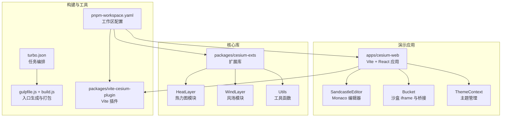
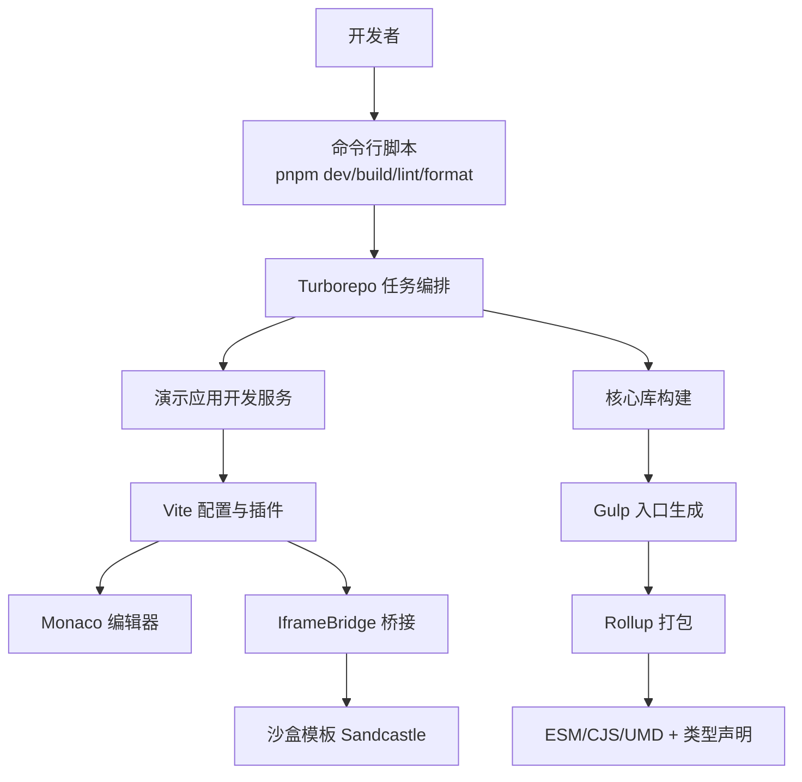
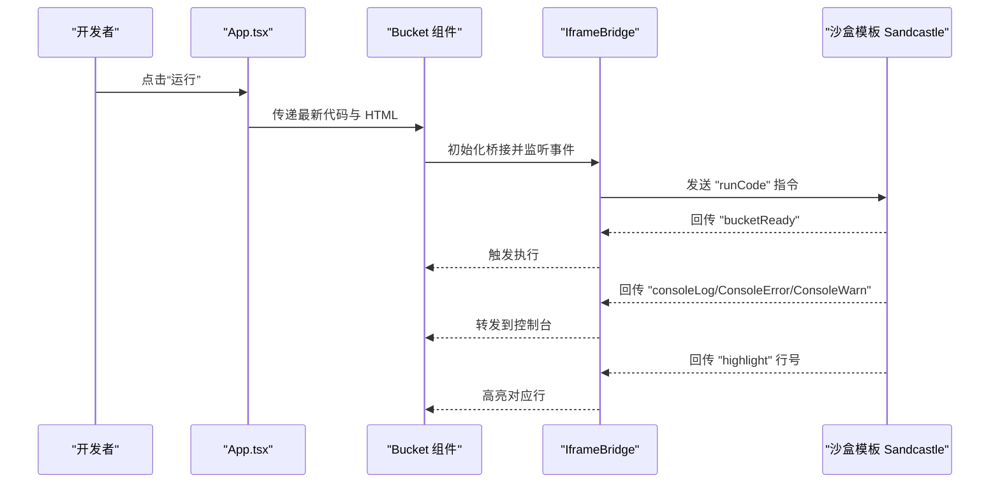
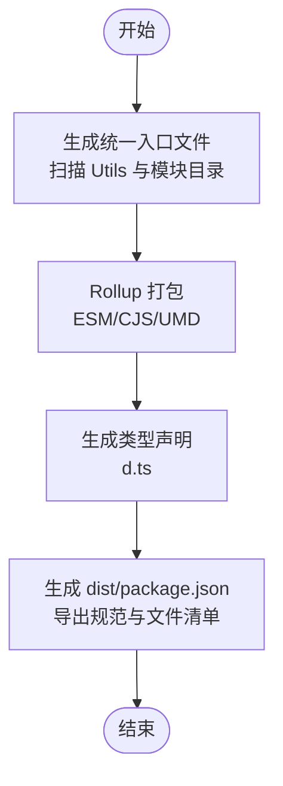
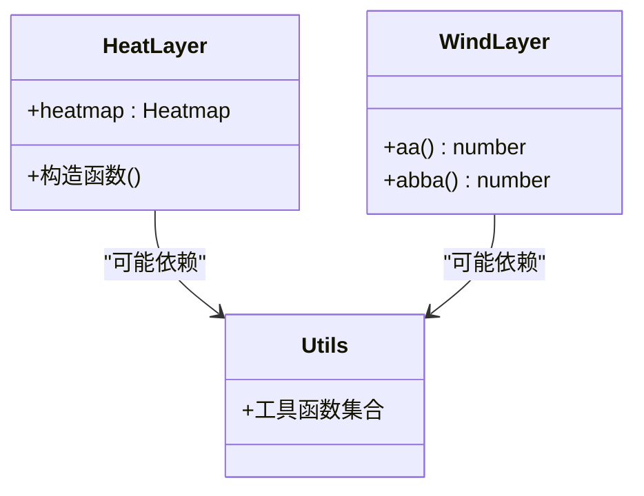
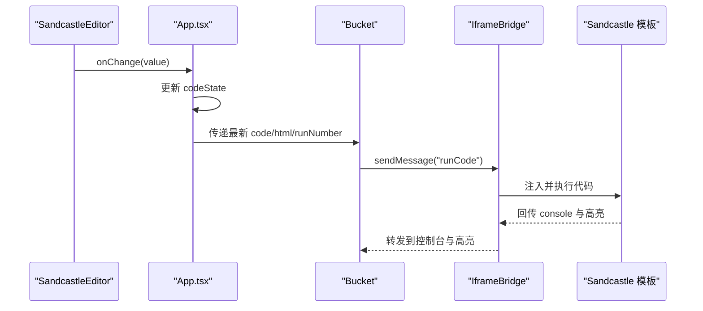
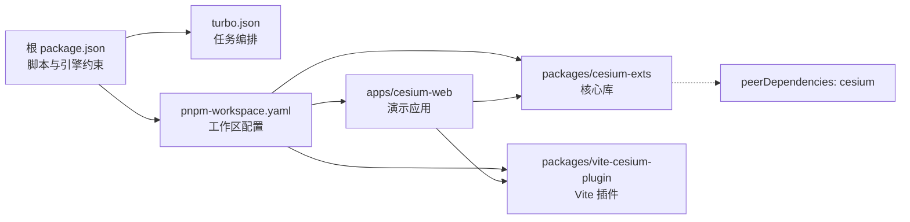

# 项目概述

<cite>
**本文引用的文件**
- [README.md](file://README.md)
- [package.json](file://package.json)
- [pnpm-workspace.yaml](file://pnpm-workspace.yaml)
- [turbo.json](file://turbo.json)
- [apps/cesium-web/package.json](file://apps/cesium-web/package.json)
- [packages/cesium-exts/package.json](file://packages/cesium-exts/package.json)
- [packages/vite-cesium-plugin/package.json](file://packages/vite-cesium-plugin/package.json)
- [apps/cesium-web/src/App.tsx](file://apps/cesium-web/src/App.tsx)
- [apps/cesium-web/src/main.tsx](file://apps/cesium-web/src/main.tsx)
- [apps/cesium-web/vite.config.ts](file://apps/cesium-web/vite.config.ts)
- [packages/cesium-exts/gulpfile.js](file://packages/cesium-exts/gulpfile.js)
- [packages/cesium-exts/scripts/build.js](file://packages/cesium-exts/scripts/build.js)
- [apps/cesium-web/src/components/Bucket/Bucket.tsx](file://apps/cesium-web/src/components/Bucket/Bucket.tsx)
- [apps/cesium-web/src/components/SandcastleEditor/SandcastleEditor.tsx](file://apps/cesium-web/src/components/SandcastleEditor/SandcastleEditor.tsx)
- [packages/cesium-exts/src/modules/HeatLayer/index.ts](file://packages/cesium-exts/src/modules/HeatLayer/index.ts)
- [packages/cesium-exts/src/modules/WindLayer/index.ts](file://packages/cesium-exts/src/modules/WindLayer/index.ts)
- [apps/cesium-web/templates/Sandcastle.ts](file://apps/cesium-web/templates/Sandcastle.ts)
</cite>

## 目录

1. [简介](#简介)
2. [项目结构](#项目结构)
3. [核心组件](#核心组件)
4. [架构总览](#架构总览)
5. [详细组件分析](#详细组件分析)
6. [依赖关系分析](#依赖关系分析)
7. [性能考虑](#性能考虑)
8. [故障排查指南](#故障排查指南)
9. [结论](#结论)
10. [附录](#附录)

## 简介

本项目是一个面向 Cesium 的高性能扩展库集合，采用 Monorepo 架构组织，目标是在 Cesium v1.141.0 生态中提供高质量、可复用的 3D 地理可视化能力。项目通过统一的构建与发布流程，提供热力图、风场等可视化组件，并配套 Vite 插件与演示应用，帮助开发者快速集成与验证。

- 核心价值主张
  - 高性能与易用性：提供热力图、风场等常用可视化组件，兼顾 Canvas2D 与 WebGL 渲染路径，满足不同场景性能需求。
  - 开发体验：内置基于 Vite + React 的演示应用，支持热更新与沙盒运行，降低学习与集成成本。
  - 类型安全：全链路 TypeScript 优先，提供完整类型定义，提升开发效率与可维护性。
  - 可扩展性：模块化设计，易于新增可视化组件；自动入口聚合与构建流程，减少样板代码。

- 技术特色
  - Monorepo 架构：使用 Turborepo + pnpm workspace 管理多包依赖与任务编排。
  - 现代化构建：基于 Gulp + Rollup 的构建流水线，生成 ESM/CJS/UMD 与类型声明。
  - 代码质量：ESLint + Prettier + Husky + lint-staged，保障团队协作一致性。
  - 沙盒运行：通过 iframe + postMessage 的跨窗口通信机制，隔离执行环境并回传控制台日志与高亮信息。

- 版本兼容性
  - Node.js >= 22.18.0
  - pnpm >= 10.10.0
  - Cesium >= 1.136.0（推荐 1.141.0）
  - TypeScript ~5.9.3
  - Vite ^7.3.1

- 应用场景
  - 地理信息可视化：如城市热力分布、气象风场模拟、人口密度展示等。
  - 教学与演示：通过沙盒编辑器与示例画廊，快速验证 Cesium 扩展组件效果。
  - 工程集成：以 ESM/CJS/UMD 三种格式发布，适配多种前端工程生态。

**章节来源**

- [README.md:1-170](file://README.md#L1-L170)
- [package.json:1-35](file://package.json#L1-L35)
- [pnpm-workspace.yaml:1-12](file://pnpm-workspace.yaml#L1-L12)

## 项目结构

项目采用 Monorepo 结构，分为演示应用与核心库两大域：

- apps/cesium-web：基于 Vite + React 的演示应用，提供编辑器、画廊、主题切换、设置对话框等界面，以及与沙盒的通信桥接。
- packages/cesium-exts：核心扩展库，包含 HeatLayer、WindLayer 等模块与工具函数，提供自动入口生成与多格式打包。
- packages/vite-cesium-plugin：Vite 插件，用于在 Vite 项目中无缝集成 CesiumJS。

**图表来源**

- [apps/cesium-web/src/App.tsx:1-149](file://apps/cesium-web/src/App.tsx#L1-L149)
- [apps/cesium-web/src/main.tsx:1-19](file://apps/cesium-web/src/main.tsx#L1-L19)
- [packages/cesium-exts/gulpfile.js:1-16](file://packages/cesium-exts/gulpfile.js#L1-L16)
- [packages/cesium-exts/scripts/build.js:1-187](file://packages/cesium-exts/scripts/build.js#L1-L187)
- [turbo.json:1-16](file://turbo.json#L1-L16)
- [pnpm-workspace.yaml:1-12](file://pnpm-workspace.yaml#L1-L12)

**章节来源**

- [README.md:90-123](file://README.md#L90-L123)
- [apps/cesium-web/package.json:1-51](file://apps/cesium-web/package.json#L1-L51)
- [packages/cesium-exts/package.json:1-48](file://packages/cesium-exts/package.json#L1-L48)
- [packages/vite-cesium-plugin/package.json:1-40](file://packages/vite-cesium-plugin/package.json#L1-L40)

## 核心组件

- 演示应用（apps/cesium-web）
  - 主入口与主题上下文：初始化插件、包裹主题提供器并挂载根组件。
  - 布局与导航：左侧工具栏、右侧主面板（视图与控制台），支持视图切换与设置弹窗。
  - 编辑器：基于 Monaco Editor 的代码编辑器，支持主题切换与自动布局。
  - 沙盒运行：通过 Bucket 组件承载 iframe，IframeBridge 负责与沙盒通信，回传控制台日志与高亮信息。

- 核心库（packages/cesium-exts）
  - 自动入口生成：扫描 Utils 与模块目录，生成统一入口文件，便于按需导出。
  - 多格式打包：Rollup 生成 ESM/CJS/UMD 与类型声明，支持发布到 npm。
  - 模块化设计：HeatLayer、WindLayer 等模块以独立 index 导出，便于扩展。

- Vite 插件（packages/vite-cesium-plugin）
  - 为 Vite 项目提供 CesiumJS 集成能力，简化构建与运行配置。

**章节来源**

- [apps/cesium-web/src/main.tsx:1-19](file://apps/cesium-web/src/main.tsx#L1-L19)
- [apps/cesium-web/src/App.tsx:1-149](file://apps/cesium-web/src/App.tsx#L1-L149)
- [apps/cesium-web/src/components/SandcastleEditor/SandcastleEditor.tsx:1-73](file://apps/cesium-web/src/components/SandcastleEditor/SandcastleEditor.tsx#L1-L73)
- [apps/cesium-web/src/components/Bucket/Bucket.tsx:1-135](file://apps/cesium-web/src/components/Bucket/Bucket.tsx#L1-L135)
- [packages/cesium-exts/scripts/build.js:27-133](file://packages/cesium-exts/scripts/build.js#L27-L133)
- [packages/cesium-exts/gulpfile.js:1-16](file://packages/cesium-exts/gulpfile.js#L1-L16)
- [packages/vite-cesium-plugin/package.json:1-40](file://packages/vite-cesium-plugin/package.json#L1-L40)

## 架构总览

整体架构围绕“演示应用 + 核心库 + 构建工具”的三层设计展开。演示应用通过 Vite 插件与沙盒通信，核心库通过自动入口与打包脚本统一输出，Monorepo 通过 Turborepo 与 pnpm workspace 协同管理。

**图表来源**

- [package.json:5-11](file://package.json#L5-L11)
- [turbo.json:1-16](file://turbo.json#L1-L16)
- [apps/cesium-web/vite.config.ts:1-81](file://apps/cesium-web/vite.config.ts#L1-L81)
- [apps/cesium-web/src/components/Bucket/Bucket.tsx:53-135](file://apps/cesium-web/src/components/Bucket/Bucket.tsx#L53-L135)
- [apps/cesium-web/templates/Sandcastle.ts:32-261](file://apps/cesium-web/templates/Sandcastle.ts#L32-L261)
- [packages/cesium-exts/gulpfile.js:7-15](file://packages/cesium-exts/gulpfile.js#L7-L15)
- [packages/cesium-exts/scripts/build.js:35-63](file://packages/cesium-exts/scripts/build.js#L35-L63)

## 详细组件分析

### 演示应用与沙盒通信（序列图）

演示应用通过 Bucket 组件加载沙盒模板，IframeBridge 负责双向通信：应用向沙盒发送运行指令，沙盒回传控制台日志与高亮信息。

**图表来源**

- [apps/cesium-web/src/App.tsx:74-112](file://apps/cesium-web/src/App.tsx#L74-L112)
- [apps/cesium-web/src/components/Bucket/Bucket.tsx:59-110](file://apps/cesium-web/src/components/Bucket/Bucket.tsx#L59-L110)
- [apps/cesium-web/templates/Sandcastle.ts:85-116](file://apps/cesium-web/templates/Sandcastle.ts#L85-L116)

**章节来源**

- [apps/cesium-web/src/App.tsx:15-145](file://apps/cesium-web/src/App.tsx#L15-L145)
- [apps/cesium-web/src/components/Bucket/Bucket.tsx:1-135](file://apps/cesium-web/src/components/Bucket/Bucket.tsx#L1-L135)
- [apps/cesium-web/templates/Sandcastle.ts:1-264](file://apps/cesium-web/templates/Sandcastle.ts#L1-L264)

### 核心库构建流程（流程图）

核心库通过 Gulp + Rollup 的流水线完成入口生成与打包，支持多格式输出与类型声明。

**图表来源**

- [packages/cesium-exts/scripts/build.js:27-133](file://packages/cesium-exts/scripts/build.js#L27-L133)
- [packages/cesium-exts/scripts/build.js:158-186](file://packages/cesium-exts/scripts/build.js#L158-L186)
- [packages/cesium-exts/gulpfile.js:7-15](file://packages/cesium-exts/gulpfile.js#L7-L15)

**章节来源**

- [packages/cesium-exts/scripts/build.js:1-187](file://packages/cesium-exts/scripts/build.js#L1-L187)
- [packages/cesium-exts/gulpfile.js:1-16](file://packages/cesium-exts/gulpfile.js#L1-L16)

### 组件类图（代码级）

核心库模块与工具的类关系示意，体现模块化与导出结构。

**图表来源**

- [packages/cesium-exts/src/modules/HeatLayer/index.ts:1-13](file://packages/cesium-exts/src/modules/HeatLayer/index.ts#L1-L13)
- [packages/cesium-exts/src/modules/WindLayer/index.ts:1-10](file://packages/cesium-exts/src/modules/WindLayer/index.ts#L1-L10)

**章节来源**

- [packages/cesium-exts/src/modules/HeatLayer/index.ts:1-13](file://packages/cesium-exts/src/modules/HeatLayer/index.ts#L1-L13)
- [packages/cesium-exts/src/modules/WindLayer/index.ts:1-10](file://packages/cesium-exts/src/modules/WindLayer/index.ts#L1-L10)

### API/服务组件（序列图）

编辑器与沙盒之间的交互流程，包括主题切换、语言选择与内容变更。

**图表来源**

- [apps/cesium-web/src/components/SandcastleEditor/SandcastleEditor.tsx:44-73](file://apps/cesium-web/src/components/SandcastleEditor/SandcastleEditor.tsx#L44-L73)
- [apps/cesium-web/src/App.tsx:74-112](file://apps/cesium-web/src/App.tsx#L74-L112)
- [apps/cesium-web/src/components/Bucket/Bucket.tsx:59-110](file://apps/cesium-web/src/components/Bucket/Bucket.tsx#L59-L110)

**章节来源**

- [apps/cesium-web/src/components/SandcastleEditor/SandcastleEditor.tsx:1-73](file://apps/cesium-web/src/components/SandcastleEditor/SandcastleEditor.tsx#L1-L73)
- [apps/cesium-web/src/App.tsx:15-145](file://apps/cesium-web/src/App.tsx#L15-L145)
- [apps/cesium-web/src/components/Bucket/Bucket.tsx:1-135](file://apps/cesium-web/src/components/Bucket/Bucket.tsx#L1-L135)

## 依赖关系分析

- Monorepo 管理
  - pnpm workspace 将 apps 与 packages 纳入同一工作区，统一版本与依赖解析。
  - Turborepo 任务编排确保构建顺序与缓存策略，加速多包开发与发布。

- 包间依赖
  - 演示应用依赖核心库与 Vite 插件，形成“应用 -> 库 -> 工具”的单向依赖。
  - 核心库对 Cesium 采用 peerDependencies，避免重复打包与版本冲突。

- 第三方生态
  - React/Vite/TypeScript/ESLint/Prettier 等现代前端技术栈，保障开发效率与质量。

**图表来源**

- [package.json:1-35](file://package.json#L1-L35)
- [turbo.json:1-16](file://turbo.json#L1-L16)
- [pnpm-workspace.yaml:1-12](file://pnpm-workspace.yaml#L1-L12)
- [apps/cesium-web/package.json:12-28](file://apps/cesium-web/package.json#L12-L28)
- [packages/cesium-exts/package.json:27-29](file://packages/cesium-exts/package.json#L27-L29)

**章节来源**

- [package.json:1-35](file://package.json#L1-L35)
- [turbo.json:1-16](file://turbo.json#L1-L16)
- [pnpm-workspace.yaml:1-12](file://pnpm-workspace.yaml#L1-L12)
- [apps/cesium-web/package.json:1-51](file://apps/cesium-web/package.json#L1-L51)
- [packages/cesium-exts/package.json:1-48](file://packages/cesium-exts/package.json#L1-L48)
- [packages/vite-cesium-plugin/package.json:1-40](file://packages/vite-cesium-plugin/package.json#L1-L40)

## 性能考虑

- 构建优化
  - Vite 开发服务器启用 host 与自动打开，提升本地联调效率。
  - Terser 压缩配置保留 Infinity、移除 console 与 debugger，减小生产体积。
  - Rollup 输出命名规则区分 js/img/media/fonts，便于缓存与资源管理。

- 运行时隔离
  - 沙盒 iframe 使用 sandbox 限制权限，避免代码对宿主页面造成影响。
  - 通过 postMessage 与桥接对象传递消息，降低耦合度与内存占用。

- 代码质量
  - ESLint + Prettier + lint-staged + Husky，保证代码风格一致与提交质量。

**章节来源**

- [apps/cesium-web/vite.config.ts:16-81](file://apps/cesium-web/vite.config.ts#L16-L81)
- [apps/cesium-web/src/components/Bucket/Bucket.tsx:124-129](file://apps/cesium-web/src/components/Bucket/Bucket.tsx#L124-L129)
- [package.json:13-20](file://package.json#L13-L20)

## 故障排查指南

- 开发环境无法启动
  - 检查 Node.js 与 pnpm 版本是否满足根与工作区要求。
  - 确认 pnpm-workspace.yaml 中的 catalog 版本与实际安装一致。

- 沙盒无响应或控制台无输出
  - 确认 Bucket 组件已收到最新 runNumber 并触发 reload。
  - 检查 IframeBridge 是否成功建立连接并监听消息。
  - 查看沙盒模板是否正确注入代码并回传 console 事件。

- 构建失败
  - 确认 Gulp 任务已生成统一入口文件。
  - 检查 Rollup 配置与输出目录权限。
  - 核对 dist/package.json 的导出字段与类型声明生成情况。

**章节来源**

- [package.json:29-33](file://package.json#L29-L33)
- [apps/cesium-web/src/components/Bucket/Bucket.tsx:59-110](file://apps/cesium-web/src/components/Bucket/Bucket.tsx#L59-L110)
- [packages/cesium-exts/scripts/build.js:27-63](file://packages/cesium-exts/scripts/build.js#L27-L63)

## 结论

本项目以 Monorepo 架构整合演示应用、核心库与构建工具，围绕 Cesium 生态提供高性能、可扩展的可视化组件与开发体验。通过自动入口生成、多格式打包与沙盒运行机制，既满足初学者快速上手，也为资深开发者提供了清晰的扩展路径与稳定的版本兼容性。

## 附录

- 快速开始
  - 克隆仓库后安装依赖，使用 pnpm dev 启动演示应用，使用 pnpm build 构建核心库。
- 常用命令
  - 开发：pnpm dev / pnpm dev:cesium-web
  - 构建：pnpm build
  - 代码检查：pnpm lint
  - 格式化：pnpm format

**章节来源**

- [README.md:31-64](file://README.md#L31-L64)
- [package.json:5-11](file://package.json#L5-L11)
